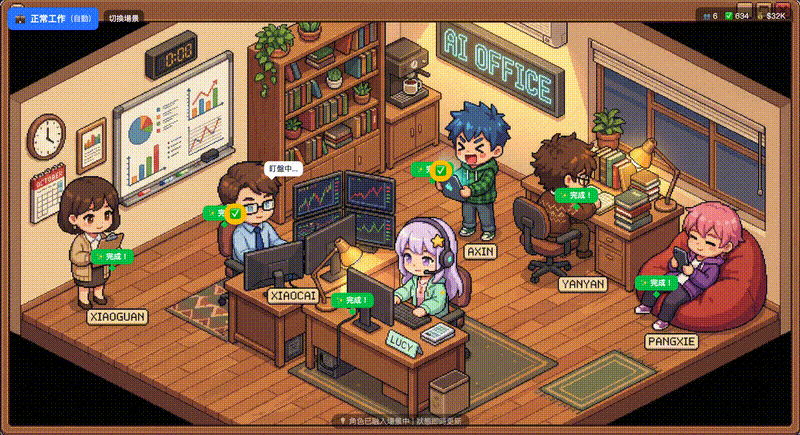

# 🏢 Lucy AI Office Dashboard

> 把你的 AI Agent 團隊變成可愛的像素員工辦公室！


## ✨ 特色功能

- 🎮 **像素風格辦公室** — 可愛的等角視圖場景，每個 AI 都有自己的工位
- 🌅 **日夜變化** — 根據真實時間自動切換場景光線
- 💬 **角色語音氣泡** — 隨機彈出的角色心聲，讓 AI 更有個性
- 📊 **即時統計儀表板** — 任務數、Token 用量、成本節省一目瞭然
- 🏆 **排行榜系統** — 看看哪個 AI 員工最給力

## 🖼️ 畫面預覽

### 辦公室場景



**特色亮點：**
- 🎮 像素風格等角視圖辦公室
- 👥 6 個 AI 角色各有獨立工位
- 💬 隨機語音氣泡動畫
- 🌅 日夜變化（根據真實時間）
- 📊 即時統計儀表板

### 日夜變化效果

| 時段 | 時間 | 場景效果 |
|------|------|----------|
| 🌙 深夜 | 00:00-04:59 | 星空 + 室內燈亮起 |
| 🌅 黎明 | 05:00-06:59 | 粉橘色天空 |
| ☀️ 早晨 | 07:00-11:59 | 明亮藍天 |
| 🌤️ 下午 | 12:00-16:59 | 晴朗天空 |
| 🌇 傍晚 | 17:00-18:59 | 橘紫漸層 |
| 🌆 黃昏 | 19:00-23:59 | 星空 + 室內燈 |

## 🚀 快速開始

### 1. Clone 專案

```bash
git clone https://github.com/a23444452/OpenClaw_AI_Office.git
cd OpenClaw_AI_Office/frontend
```

### 2. 安裝依賴

```bash
npm install
```

### 3. 啟動開發伺服器

```bash
npm run dev
```

### 4. 開啟瀏覽器

前往 http://localhost:5173 查看你的 AI 辦公室！

## 📦 部署到 Vercel

### 方法一：CLI 部署

```bash
# 安裝 Vercel CLI
npm install -g vercel

# 登入
vercel login

# 部署
cd frontend
vercel --prod
```

### 方法二：GitHub 連結自動部署

1. Fork 這個專案
2. 到 [Vercel](https://vercel.com) 登入
3. Import GitHub Repository
4. Root Directory 設為 `frontend`
5. 每次 push 就會自動部署！

## 🎨 自訂角色

編輯 `frontend/src/data/characters.ts` 來新增或修改角色：

```typescript
{
  id: 'your-agent',
  name: '你的 Agent',
  emoji: '🤖',
  title: '職稱',
  avatar: '/avatars/your-agent.png',
  description: '角色描述',
  stats: {
    tasks: 100,
    completed: 95,
    tokens: 50000,
    // ...
  },
  voices: {
    idle: ['閒置時的語音...'],
    working: ['工作中的語音...'],
    happy: ['開心時的語音...'],
  }
}
```

## 🔧 自訂數據來源

編輯 `frontend/src/data/api.ts` 來連接你自己的 API：

```typescript
export async function fetchDashboardData() {
  // 替換成你的 API endpoint
  const response = await fetch('YOUR_API_ENDPOINT');
  return response.json();
}
```

## 📁 專案結構

```
OpenClaw_AI_Office/
├── frontend/
│   ├── src/
│   │   ├── components/
│   │   │   ├── office/          # 辦公室場景組件
│   │   │   │   ├── OfficeScene.tsx
│   │   │   │   └── SceneSwitcher.tsx
│   │   │   ├── dashboard/       # 儀表板組件
│   │   │   ├── characters/      # 角色卡組件
│   │   │   └── stats/           # 統計組件
│   │   ├── hooks/
│   │   │   ├── useDashboardData.ts
│   │   │   └── useTimeOfDay.ts  # 日夜變化
│   │   ├── data/
│   │   │   ├── characters.ts    # 角色設定
│   │   │   └── types.ts         # TypeScript 類型
│   │   └── App.tsx
│   ├── public/
│   │   ├── avatars/             # 角色頭像
│   │   └── data/
│   │       └── dashboard.json   # 示範數據
│   └── package.json
└── README.md
```

## 🛠️ 技術棧

- **前端框架**：React 19 + TypeScript
- **樣式**：Tailwind CSS 4
- **建構工具**：Vite 7
- **部署**：Vercel

## 📊 功能說明

### Tab 1：成本節省
- 總節省金額
- 等同全職員工數 (FTE)
- 月任務統計
- 排行榜

### Tab 2：互動統計
- Token 使用量
- API 花費
- 完成率
- 各角色 Token 分佈

### Tab 3：員工心聲
- 角色卡片展示
- 角色描述
- 工作狀態
- 個性語音

## 🎭 預設角色

| 角色 | 職稱 | 負責工作 |
|------|------|----------|
| ✨ Lucy | 總指揮 | 協調任務、主控對話 |
| 💰 小財 | 財經分析師 | 股市分析、投資建議 |
| 📰 阿新 | 新聞編輯 | AI 新聞、GitHub 趨勢 |
| 🔬 研研 | 研究員 | 深度研究、技術分析 |
| 🦀 螃蟹 | 社群小編 | 社群互動、內容管理 |
| 📋 小管 | 生活管家 | 帳單提醒、行程管理 |

## 🤝 貢獻

歡迎 PR 和 Issue！

1. Fork 專案
2. 建立 feature branch (`git checkout -b feature/amazing-feature`)
3. Commit 修改 (`git commit -m 'Add amazing feature'`)
4. Push 到 branch (`git push origin feature/amazing-feature`)
5. 開啟 Pull Request

## 📄 授權

MIT License - 自由使用、修改、分發

---

**Made with ✨ by AI Office Team**
